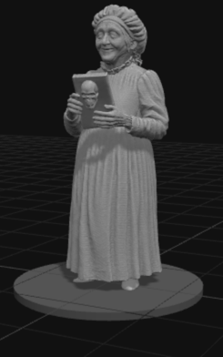

# Figurinify — Base & STL Exporter

Create tabletop-ready miniatures from your 3D character models:
- Load a GLB/GLTF model
- Auto-center and align to a printable base
- Choose base shape and size, figurine print size presets
- Export watertight STL for printing

Live site: https://andytwoods.github.io/Figurinify/



## Quick start (local)
1. Clone the repo
2. Serve the folder with any static server (so GLTF loads without CORS issues), e.g.:
   ```bash
   npx http-server -p 8080
   ```
3. Open http://localhost:8080/

## Usage
- Pick a D&D size (real-life) and a figurine print size preset.
- Adjust base diameter (cm), base height (mm), and base shape.
- Load your character model (`.glb` preferred; `.gltf` supported with its `.bin` and textures).
- Export STL when happy with size and base.

## Meshy GLB Downloader

`meshy_glb_downloader.py` is a standalone utility for downloading 3D models from Meshy.ai.

### Building the executable

**Windows:**
```powershell
py -m venv .venv
.\.venv\Scripts\Activate.ps1
python -m pip install --upgrade pip
pip install textual requests pyinstaller

pyinstaller --noconfirm --clean --onefile --console --name "meshy-glb-downloader" main.py

deactivate
```

**macOS:**
```bash
python3 -m venv .venv
source .venv/bin/activate
python -m pip install --upgrade pip
pip install textual requests pyinstaller

pyinstaller --noconfirm --clean --onefile --windowed --name "Meshy GLB Downloader" main.py

deactivate
```

## Notes
- Three.js and helpers are loaded from unpkg CDN.

## License
Code: MIT — see `LICENSE`.